# OpenDirect v2.1 Object Relationships

## Core Object Relationships

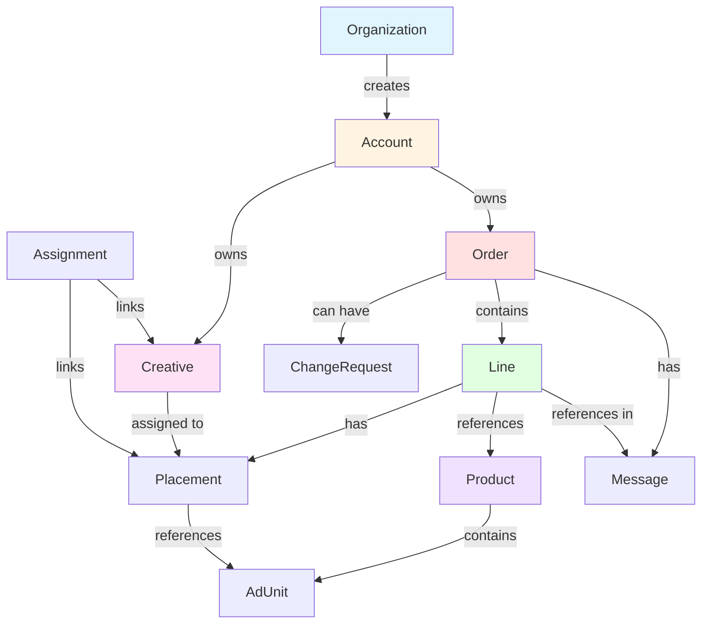

## Workflow State Diagram

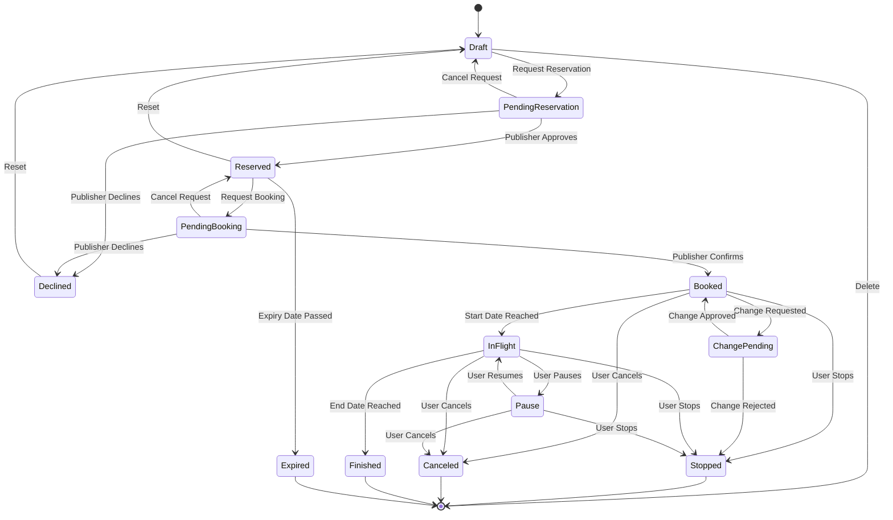

## Account and Organization Hierarchy

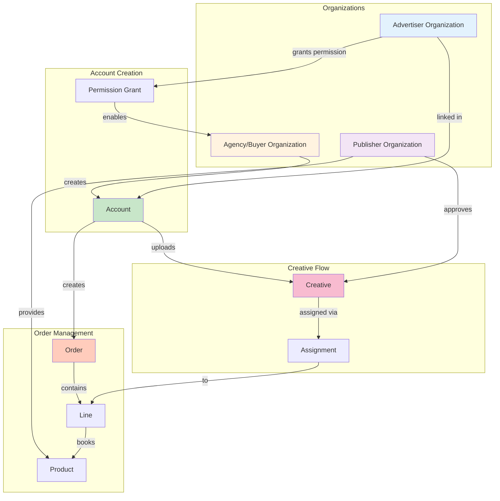

## Complete Booking Workflow

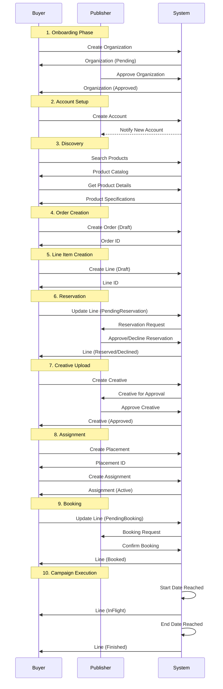

## Creative Assignment Flow

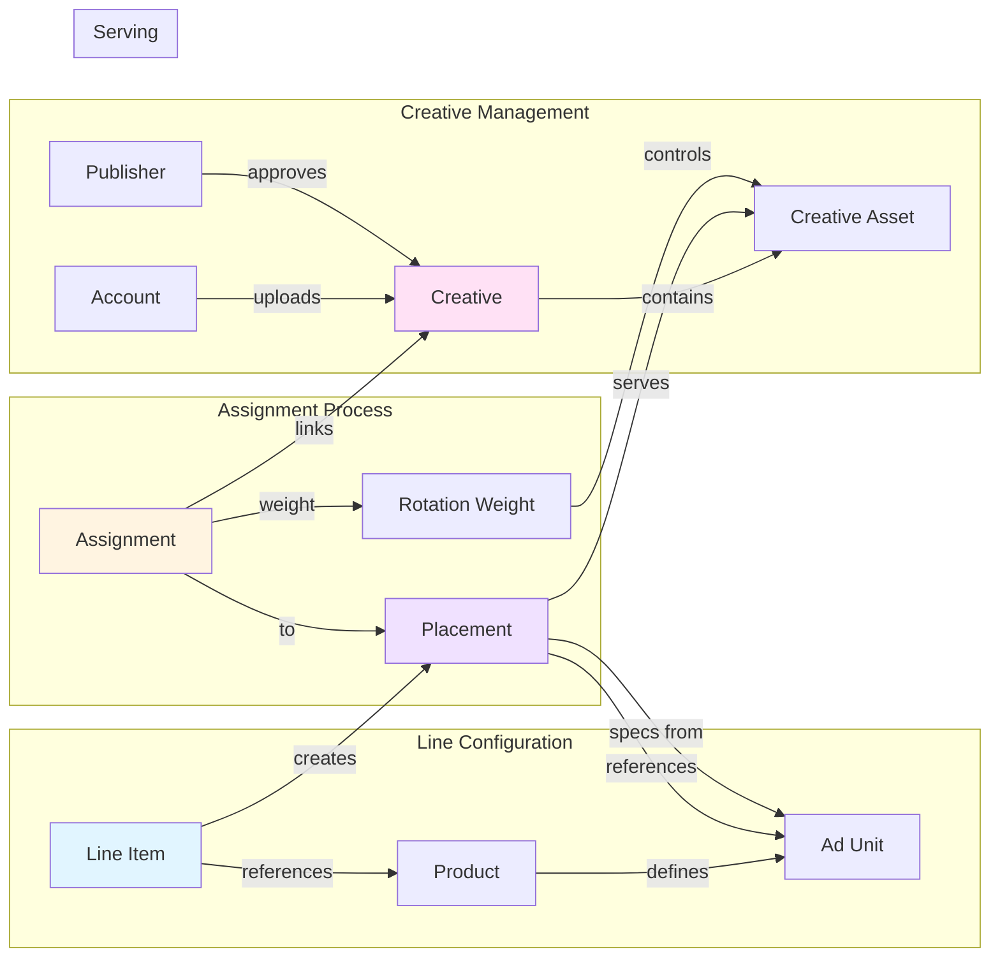

## Data Model - AdCOM Integration

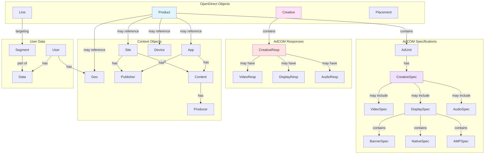

## Private Marketplace Integration

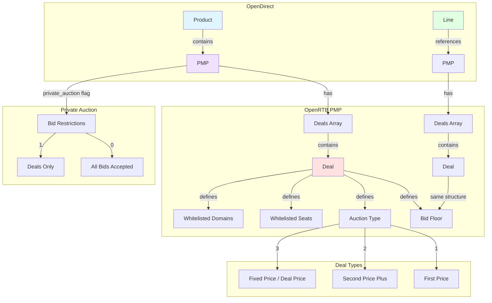

## Change Request Workflow

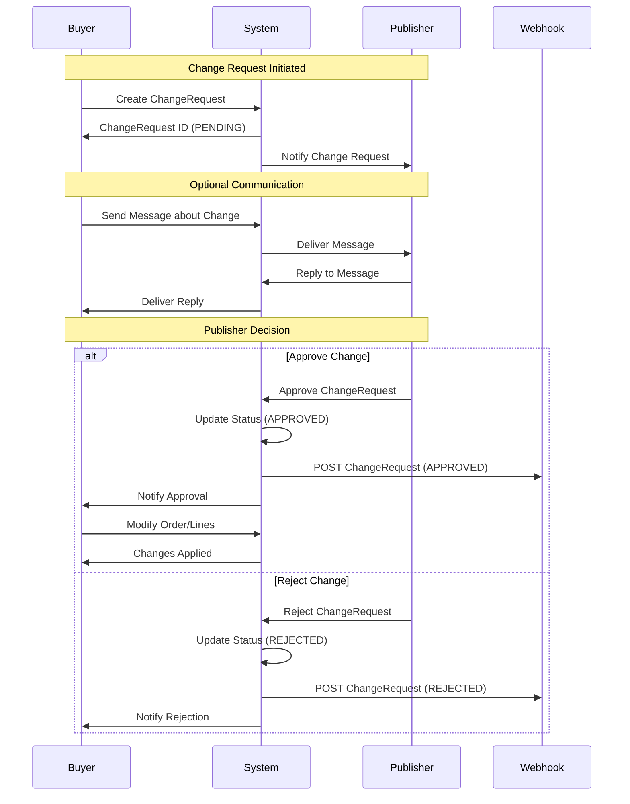

## Message Thread Flow

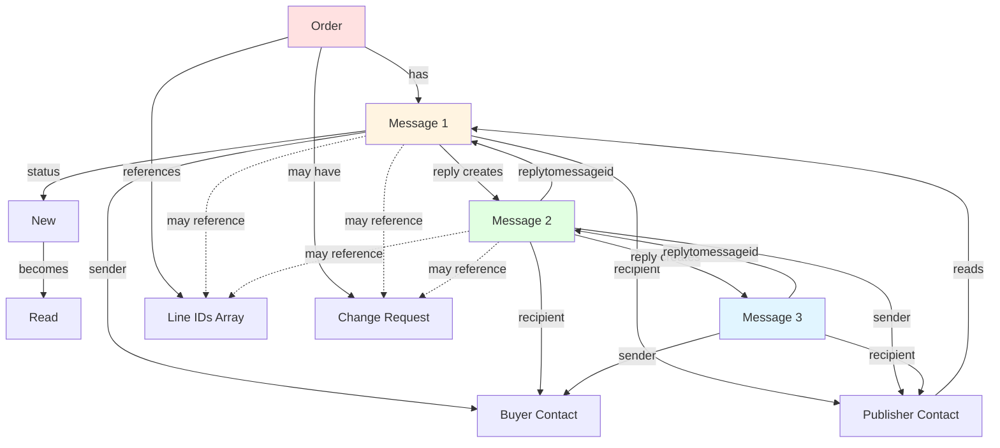

## Rate Type Application

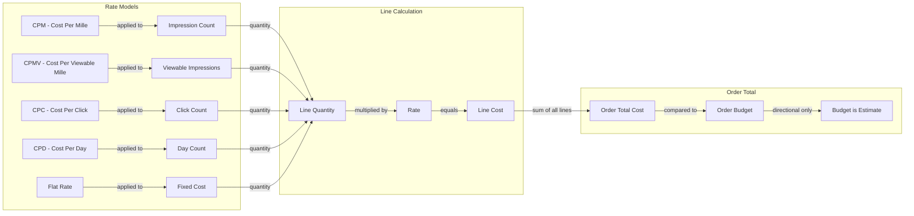

## Organization Status Lifecycle

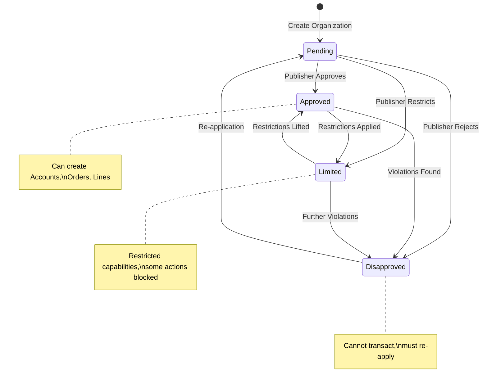

These diagrams provide a comprehensive visual reference for the OpenDirect v2.1 object model, relationships, and workflows.
